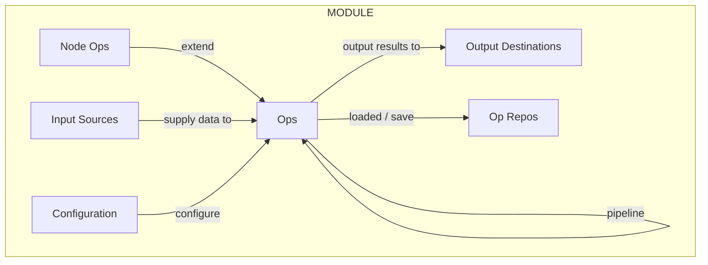

# Ops4J Guide

Ops4j is a framework for getting things done and keeping things simple.   Ops4j provides a framework for defining `operations` which present themselves as command line utilities which integrate seamlessly into any native CLI which supports `bash`. 

## Ops4J from the command line

> When we want to **create a single record**, we say things like:

```bash
# Generate a single pretty printed record
map -D 1 -P /=gen-person:
```

which gives us output of the form:

```javascript
{
  "first" : "Taylor",
  "last" : "Smith",
  "cell-phone" : "083-452-3581",
  "work-phone" : "787.284.0846 x735",
  "marital-status" : "Divorced",
  "race" : "White",
  "sex" : "Female",
  "city" : "Casperland",
  "state" : "WA",
  "address" : "246 Columbus Tunnel",
  "zip" : "48668-2206"
}
```

when we want to create lots of data we say things like:

```bash
# generate a million people
map -D 1000000 /=gen-person:
```

We can quickly create **massive amounts of custom data** this way.  There are lots of node operations like gen-person to generate different types of data via the `map` operation.

> When we want to create and store data we combine the `map` operation with the `mongo-insert` operation to create a database of 1,000 people records:

```bash
map -D 1000 /=gen-person: | mongo-insert -c people
```

We can quickly create database of all type of content and sizes.

> When we want to read the data back we can say:

```bash
mongo-stream -c people
```

> When we want to read the data back selectively or transformatively we can say powerfully expressive things like:

```bash
# Stream the data back and use native-cli command 'wc -l' to
# count the rows returned.
mongo-stream -c people | wc -l

# Zipcodes starting with 91
mongo-stream -c people '{"$match":{"zip":{"$regex":"^91.*"}}}'

# Just names:
mongo-stream -c people '{"$match":{}}' \
  '{"$project":{"first":1,"last":1}}'
```

Working with data becomes fluid.

> We can do even more exciting things when we combine these capabilities with the capabilities of other operations such as `benchmark` or `http-server`.

```bash
# Measure how fast we can download a copy of the people collection
# from mongo.
mongo-stream -c people > people.json

# Explore the data and learn more about ops4j:
people.json | http-server

# Create dashboards for interesting combinations we discover:
cat people.json | \
  pipeline 'map /=select:state,zip,age | SCATTER: | SANKEY:'
```

> In addition to the ability to generate data, the `map` command allows us to map or transform data from one form into another.  We can also save pipelines by name so we can abstract complex mappings into more manageable mnemonically pipelines we can call back by name.

```bash
# Simple datatype transformation:
cat people.json | map /=/ /age=int:/age /zip=int:/zip

# Lets name and save this pipeline:
map /=/ /age=int:/age /zip=int:/zip -S JSON | ops save SANITIZE-PEOPLE

# We can later find it:
ops ls

# Then run it by name in situations where it's important, such as
# when feeding databases:
cat people.json | pipeline 'SANITIZE-PEOPLE: | mongo-insert -c speople'
cat people.json | pipeline 'SANITIZE-PEOPLE: | jdbc-create speople'
```

Intrigued?  Unconvinced?  Please read on! Let's create an open community of common purpose, portable components together.

## Operations and Node Operations

In the previous section we saw a series of useful examples where we introduced a combination of operations and node operations without much explanation as to what the difference was.  I hope to rectify that here.

* ***Operations provide the main utilities*** of the Ops4J ecosystem.  In a native CLI setting, operations become the main command line utilities like sed, cat and grep on Unix systems.

* ***Node Operations provide a way to modify a given node of data.*** For example, we have the node operations `encrypt` and `decrypt` which allow us to read or write encrypted data throughout our ecosystem of operations.  Node operations provide a method for extending how operations process nodes.  This, in turn, gives operations such as `map` amazing and extensible capabilities.

## InputSources and OutputDestinations

InputSources, as the name indicates, provides us with sources of input.  OutputDestinations providing us with a destination for output.  

Given input and output sources of `stdin:`, `stdout:`, `file:` and `csv:`, it becomes possible to say powerful, fluid things like:

```bash
cat report.csv | \
  map -D csv:stdin: /=/ /name="report1" /date=now: | \
  mongo-insert -c reports
```

as well in reverse:

```bash
mongo-stream -c reports '{"$match":{"name":"report1"}}' | \
  write-csv file:report1.csv
```

Given an ecosystem of the following:

| NAME    | TYPE           | COMMENT                           |
| ------- | -------------- | --------------------------------- |
| file:   | Input / Output | Read and write from file sources. |
| csv:    | Input / Output | Read and write from csv sources.  |
| stdin:  | Input          | Read from standard input.         |
| stdout: | Output         | Write output to standard out.     |
| http:   | Input          | Read from http.                   |
| https:  | Input          | Read from https.                  |
| mongo:  | Input / Output | Read / Write to/from mongo.       |
| excel:  | Input          | Read from excel.                  |
| jdbc:   | Input / Output | Read / Write to JDBC.             |

the combinations bring exponential combinations and the IO system is extensible.  This might be the extension point for supporting things such as key-vaults or simple expression engines.

## Modules

Modules are groups of Operations, Node Operations, Input Sources, Output Sources and configuration, presumably with some cohesive aspect ranging from database access to language support.  User supplied modules are treated identically to the official ones provided on this site.  Installation is as simple as dropping the compiled jar files and their dependencies into the Ops4J directory or configuring the classpath in some alternate and equivalent manner.



# Ops4J Reference

## CLI

The Ops4J CLI provides a command line interface (CLI) into Ops4J.  This CLI enables the user to configure their environment, save named operations as well as get help and system information.

When run on the CLI, Ops4J provides a command line API to make life easier.  The CLI interface:

```bash
Usage: ops [-h] [COMMAND]
This is the top level CLI for Ops4J.  This CLI provides tooling
 for managing operations.
  -h, --help   Display help.
Commands:
  env         Output environmental information.
  get         Get one or more configuration options.
  info, help  Get information on operations, node-operations, repositories,
                input sources, output destinations or modules.
  list, ls    List operations within the specified repository.
  remove, rm  Remove an operation from the designated repository.
  run         Run the designated operation from the optionally designated op
                repository.
  save        Save an operation to the designated repository.
  set         Set configuration options.
  toc         Table of contents.
```

In subsequent sections, we will cover each of these options in turn.

### env

> Output environmental information.

The `ops env` command allows the user to emit environmental information in different forms.  This allows for environmental bootstrapping which can be configurable across bash shells running on various environments.  Extension for other shells should be straightforward.

**<u>help:</u>**

```bash
$ ops env -h
Usage: env [-h] [--unix] [-in-ns=<isNamespace>] [-L=<logLevel>]
           [--launcher=<launcher>] [-nodeop-ns=<nodeOpNamespace>]
           [-op-ns=<opNamespace>] [-out-ns=<osNamespace>]

Output environmental information.

Options:

  -h, --help             Get help.
      -in-ns, -input-source-namespace=<isNamespace>
                         An optional namespace which will be prepended to input
                           source aliases to prevent collisions with existing
                           OS utilities or other ops4j aliases.
  -L, --log=<logLevel>   The log level of this operation.
      --launcher=<launcher>
                         An optional namespace to be prepended to operation
                           aliases to prevent any collisions with existing OS
                           utilities or other ops4j aliases.
      -nodeop-ns, -node-op-namespace=<nodeOpNamespace>
                         An optional namespace to be prepended to operation
                           aliases to prevent any collisions with existing OS
                           utilities or other ops4j aliases.
      -op-ns, --op-namespace=<opNamespace>
                         An optional namespace which will be prepended to node
                           operation aliases to prevent collisions with
                           existing OS utilities or other ops4j aliases.
      -out-ns, --output-dest-namespace=<osNamespace>
                         An optional namespace which will be prepended to
                           output destination aliases to prevent collisions
                           with existing OS utilities or other ops4j aliases.
      --unix             When true, emit unix line separators.
```

#### General Usage

In the general case we assume that our operation names do not collide with the rest of our native CLI.  So there is no need to wrap operations in a namespace.  However, we wish to namespace node operations, input sources and output destinations into their own namespaces so that we can interact with them independently in the shell/CLI.

```bash
ops env -nodeop-ns=no: -in-ns=in: -out-ns=out:
```

which will emit an environment where node ops are prefaced with a 'no:' namespace prefix.  Input Sources will be prefaced by 'in:' and Output Sources by 'out:'.

At the time I write this, my envionment looks like:

```bash
####################
## Operation aliases
####################
alias backlog="java org.ops4j.op.Backlog"
alias bash-exec="java org.ops4j.op.shell.BashExec"
alias bash-filter="java org.ops4j.op.shell.BashFilter"
alias bash-source="java org.ops4j.op.shell.BashSource"
alias benchmark="java org.ops4j.op.Benchmark"
alias disruptor="java org.ops4j.op.LmaxDisruptor"
alias filter="java org.ops4j.op.Filter"
alias flatten="java org.ops4j.op.Flatten"
alias groovy-template="java org.ops4j.groovy.op.GroovyTemplate"
alias http-client="java org.ops4j.http.op.HttpClientOp"
alias http-get="java org.ops4j.http.op.HttpGetOp"
alias http-server="java org.ops4j.http.op.HttpServer"
alias http-view="java org.ops4j.http.op.HttpView"
alias jdbc-create="java org.ops4j.jdbc.op.JdbcCreate"
alias jdbc-drop="java org.ops4j.jdbc.op.JdbcDrop"
alias jdbc-insert="java org.ops4j.jdbc.op.JdbcInsert"
alias jdbc-stream="java org.ops4j.jdbc.op.JdbcStream"
alias jhead="java org.ops4j.op.Head"
alias logphases="java org.ops4j.op.test.LogPhases"
alias logtest="java org.ops4j.op.test.LogTest"
alias map="java org.ops4j.op.MapJson"
alias model-usl="java org.ops4j.op.ModelUsl"
alias mongo-insert="java org.ops4j.mongo.op.MongoInsert"
alias mongo-stream="java org.ops4j.mongo.op.MongoStream"
alias noop="java org.ops4j.op.NoOp"
alias op-info="java org.ops4j.op.OpInfo"
alias pause="java org.ops4j.op.Pause"
alias pipeline="java org.ops4j.op.Pipeline"
alias poe="java org.ops4j.http.op.PoeOp"
alias print="java org.ops4j.op.Print"
alias remove-nulls="java org.ops4j.op.RemoveNulls"
alias route="java org.ops4j.op.Route"
alias shell="java org.ops4j.op.Shell"
alias shuffle="java org.ops4j.op.Shuffle"
alias simulate="java org.ops4j.op.Simulate"
alias smile:cluster="java org.ops4j.smile.op.Cluster"
alias sort="java org.ops4j.op.Sort"
alias stream="java org.ops4j.op.Stream"
alias stream-lines="java org.ops4j.op.StreamLines"
alias tail="java org.ops4j.op.Tail"
alias unwind="java org.ops4j.op.Unwind"
alias viz-flow="java org.ops4j.visual.op.VisualFlow"
alias viz-sequence="java org.ops4j.visual.op.VisualSequence"
alias viz-tree="java org.ops4j.visual.op.VisualTree"
alias vw="java org.ops4j.http.op.View"
alias web-view="java org.ops4j.http.op.WebViewer"
alias wss="java org.ops4j.http.op.WebSocketServer"
alias xray="java org.ops4j.op.XRay"

########################
# Node operation aliases
########################
alias no:array="java org.ops4j.nodeop.CreateArray"
alias no:array-add="java org.ops4j.nodeop.ArrayAdd"
alias no:avg="java org.ops4j.nodeop.Avg"
alias no:choose="java org.ops4j.nodeop.RandomChoice"
alias no:cos="java org.ops4j.nodeop.Cosine"
alias no:count="java org.ops4j.nodeop.Counter"
alias no:decrypt="java org.ops4j.nodeop.Decrypt"
alias no:dist="java org.ops4j.nodeop.gen.DistributionGenerator"
alias no:double="java org.ops4j.nodeop.gen.DoubleGenerator"
alias no:encrypt="java org.ops4j.nodeop.Encrypt"
alias no:eval="java org.ops4j.groovy.op.Eval"
alias no:gen-address="java org.ops4j.nodeop.gen.AddressGenerator"
alias no:gen-cell="java org.ops4j.nodeop.gen.CellPhoneGenerator"
alias no:gen-city="java org.ops4j.nodeop.gen.CityGenerator"
alias no:gen-code="java org.ops4j.nodeop.gen.CodeGenerator"
alias no:gen-data="java org.ops4j.nodeop.GenData"
alias no:gen-date="java org.ops4j.nodeop.gen.DateGenerator"
alias no:gen-first="java org.ops4j.nodeop.gen.FirstNameGenerator"
alias no:gen-int-array="java org.ops4j.nodeop.gen.IntArrayGenerator"
alias no:gen-key="java org.ops4j.nodeop.GenKey"
alias no:gen-last="java org.ops4j.nodeop.gen.LastNameGenerator"
alias no:gen-lat-long="java org.ops4j.nodeop.gen.LatLongGenerator"
alias no:gen-name="java org.ops4j.nodeop.gen.NameGenerator"
alias no:gen-person="java org.ops4j.nodeop.gen.PersonGenerator"
alias no:gen-phone="java org.ops4j.nodeop.gen.PhoneGenerator"
alias no:gen-state="java org.ops4j.nodeop.gen.StateGenerator"
alias no:gen-text="java org.ops4j.nodeop.gen.TextGenerator"
alias no:int="java org.ops4j.nodeop.gen.IntegerGenerator"
alias no:jpath="java org.ops4j.nodeop.JsonPath"
alias no:keywords="java org.ops4j.smile.nlp.nodeop.Keywords"
alias no:match="java org.ops4j.nodeop.IsMatch"
alias no:min="java org.ops4j.nodeop.Min"
alias no:missing="java org.ops4j.nodeop.GenMissing"
alias no:normalize="java org.ops4j.smile.nlp.nodeop.Normalize"
alias no:now="java org.ops4j.nodeop.Now"
alias no:null="java org.ops4j.nodeop.GenNull"
alias no:pct="java org.ops4j.nodeop.Percentile"
alias no:plus="java org.ops4j.nodeop.Plus"
alias no:random-text="java org.ops4j.nodeop.gen.RandomTextGenerator"
alias no:run="java org.ops4j.nodeop.Pipeline"
alias no:sentences="java org.ops4j.smile.nlp.nodeop.Sentences"
alias no:seq="java org.ops4j.nodeop.Sequence"
alias no:sin="java org.ops4j.nodeop.Sine"
alias no:slope="java org.ops4j.nodeop.Slope"
alias no:split="java org.ops4j.nodeop.Split"
alias no:text="java org.ops4j.nodeop.Text"
alias no:to-double="java org.ops4j.nodeop.ToDouble"
alias no:to-float="java org.ops4j.nodeop.ToFloat"
alias no:to-int="java org.ops4j.nodeop.ToInteger"
alias no:to-lower="java org.ops4j.nodeop.ToLower"
alias no:to-month="java org.ops4j.nodeop.ToMonth"
alias no:to-string="java org.ops4j.nodeop.ToString"
alias no:to-upper="java org.ops4j.nodeop.ToUpper"
alias no:words="java org.ops4j.smile.nlp.nodeop.Words"

########################
# Input source aliases
########################
alias in:csv="java org.ops4j.io.CsvSource"
alias in:file="java org.ops4j.io.FileSource"

############################
# Output destination aliases
############################
alias out:file="java org.ops4j.io.FileSource"
```

The output of this program can be incorporated directly into shell startup such that these commands are seamlessly integrated into native shell environments.  This means that we can access operations directly from the command line.

```bash
map -h
map -D 1 /=gen-person:
```

we can also access node operations directly:

```bash
no:gen-person -h
no:gen-person -D 1
```

and the same goes for input sources and output destinations.

```bash
in:file -H
in:csv -H
out:file -H
```

All of this is great for unit testing and getting direct help on any aspect of the ops4j ecosystem.

### get

> get environmental setting information.

**<u>help:</u>**

```bash
Usage: get [-h] [-L=<logLevel>] [<path>]

Get one or more configuration options.

Parameters:

      [<path>]           A path to a specfic option.

Options:

  -h, --help             Get help.
  -L, --log=<logLevel>   The log level of this operation.
```

#### General Usage

```bash
# Get all environmental settings
ops get

# Get all JDBC envionmental settings
ops get JDBC

# Get MONGO settings for the DEV cluster
ops get MONGO.DEV
```

### info / help

> Get info/help.

**<u>help:</u>**

```bash
Usage: info [-hl] [-L=<logLevel>] [-t=<infoType>] [<pattern>]

Get information on operations, node-operations, repositories, input sources,
output destinations or modules.

Parameters:

      [<pattern>]         An optional search pattern.

Options:

  -h, --help              Get help.
  -l, --long              When set, produce long listings for operations.
  -L, --log=<logLevel>    The log level of this operation.
  -t, --type=<infoType>   Filter information to the specified type. Valid
                            Values: (OP, NODEOP, REPO, SOURCE, DESTINATION,
                            MODULE, ALL)
```

#### General Usage

```bash
# dump all help
ops help
# dump all help - long listing
ops help -l
# dump all help on mongo
ops help mongo
# long listing
ops help mongo -l
# long listing of http ops
ops help http -l -t op
```

### list / ls

> List named operations within a repository.

**<u>help:</u>**

```bash
Usage: list [-h] [-L=<logLevel>] [-r=<repoName>] [-w=<width>]

List operations within the specified repository.

Options:

  -h, --help              Get help.
  -L, --log=<logLevel>    The log level of this operation.
  -r, --repo=<repoName>   The repository to list operations from.
  -w, --width=<width>     The width of the listing.
```

#### General Usage

```bash
# List all named operations
ops list
ops ls
```

### remove / rm

> Remove named operations from a repository.

**<u>help:</u>**

```bash
Usage: remove [-h] [-L=<logLevel>] [-r=<repoName>] [<opName>]

Remove an operation from the designated repository.

Parameters:

      [<opName>]          The name of the operation to save.

Options:

  -h, --help              Get help.
  -L, --log=<logLevel>    The log level of this operation.
  -r, --repo=<repoName>   The repository to save the operation to.
```

#### General Usage

```bash
# Remove named operation 'my-op'
ops rm my-op

# Same thing, more typing:
ops remove my-op
```

### run

> Run a named operations.

**<u>help:</u>**

```bash
Usage: run [-h] [-L=<logLevel>] [-r=<repoName>] [<opName>]

Run the designated operation from the optionally designated op repository.

Parameters:

      [<opName>]          The name of the operation to run.

Options:

  -h, --help              Get help.
  -L, --log=<logLevel>    The log level of this operation.
  -r, --repo=<repoName>   The repository to run the operation from.
```

#### General Usage

```bash
echo '{}' | ops run @make-person
```

### save

> Save a named operations.

**<u>help:</u>**

```bash
Usage: save [-h] [-L=<logLevel>] [-r=<repoName>] [<opName>]

Save an operation to the designated repository.

Parameters:

      [<opName>]          The name of the operation to save.

Options:

  -h, --help              Get help.
  -L, --log=<logLevel>    The log level of this operation.
  -r, --repo=<repoName>   The repository to save the operation to.
```

#### General Usage

```bash
map /=gen-person: -S JSON | ops save make-person
```

### set

TODO: Implement

> Set an environmental variable.

**<u>help:</u>**

```bash
Usage: set [-eh] [-L=<logLevel>] [<name>=<value>...]

Set configuration options.

Parameters:

      [<name>=<value>...]   Zero or more name value pairs indicating the
                              configuration options that we wish to set.  These
                              configuration options are set within the user's
                              home directory in a file named ops4j.yaml.

                            Examples:

                            # set option a to value b.
                            ops set a=b
                            # set option a=b and option c=d
                            ops set a=b c=d

Options:

  -e, --encrypt             Encrypt the field being set.
  -h, --help                Get help.
  -L, --log=<logLevel>      The log level of this operation.
```

#### General Usage

```bash
# Set foo to bar
ops set foo=bar
# Set foo to the encrypted value of bar.
ops set -e foo=bar
# Set nested variable:
ops set MONGO.DEV.credentials.username=user1
ops set -e MONGO.DEV.credentials.password=my_secret
```

### toc

> Print a table of contents.

**<u>help:</u>**

```bash
Usage: toc [-h] [-L=<logLevel>] [--type=<type>] [<pattern>]

Table of contents.

Parameters:

      [<pattern>]        A search pattern.

Options:

  -h, --help             Get help.
  -L, --log=<logLevel>   The log level of this operation.
      --type=<type>      The type.
```

#### General Usage

```bash
# Table of contents on everything
ops toc
# Table of contents on operations only
ops toc --type=op
# Table of contents on things which contain "mongo" in their name.
ops toc mongo
```

## CORE

### Operations

Operations provide single purpose utilities which can be combined in pipelines to accomplish more complex task.  This section will document each of these utilities/operations.

#### backlog

> Service a backlog of task concurrently.

**<u>help:</u>**

```bash
backlog -H
Usage: backlog [-C=<view>] [-iqt=<inputQueueType>] [-L=<logLevel>]
               [-max=<maxThreads>] [-min=<minThreads>] [-N=<name>]
               [-oqt=<outputQueueType>] <commands>

Run operations using a backlog feeding concurrent workers.

      <commands>         The commands to be executed.

      -iqt, --input-queue-type=<inputQueueType>
                         The input queue type.
      -max, --max-threads=<maxThreads>
                         The maximum number of threads.
      -min, --min-threads=<minThreads>
                         The minimum number of threads.
      -oqt, --output-queue-type=<outputQueueType>
                         The output queue type.

Class: org.ops4j.op.Backlog
```

##### General Usage

Consider a workload of 1,000 task which are simulated by `pause 1000` which is equivalent to a 1,000 milliecond or 1 second pause.  We run this via a single backlog thread here:

and see that it performs at roughly 1 TPS.  

We now use backlog to run this same workload concurrently.

THIS IS BROKEN: TODO: FIX IT

```bash
backlog -D 1000 'pause 1000' -min 2 -max 2 | benchmark -O none
backlog -D 1000 'pause 1000' -min 16 -max 16 | benchmark -O none
backlog -D 10000 'pause 1000' -min 64 -max 64 | benchmark -O none

backlog -D 10000 'pause 1000' -min 128 -max 128 | benchmark -O none
$ backlog -D 10000 'pause 1000' -min 128 -max 128 | benchmark -O none

17:18:25.094 INFO  benchmark - ***********************************************************
17:18:25.096 INFO  benchmark - ** benchmark @ Wed Nov 27 17:17:05 EST 2024
17:18:25.096 INFO  benchmark - ***********************************************************
17:18:25.096 INFO  benchmark - ***********************************************************
17:18:25.098 INFO  benchmark - TPS:  0.0, TXNS: 0, Duration: 80.041 seconds
17:18:25.098 INFO  benchmark - ***********************************************************
```

#### bash-exec

> Execute a bash script.

Use bash-exec when you just want to execute some bash commands without impact to the stream.

**<u>help:</u>**

```bash
Usage: bash-exec [-C=<view>] [-L=<logLevel>] [-N=<name>] <commands>...

Execute a bash command leaving the stream unchanged.

      <commands>...      The command to execute.

  -C, --config=<view>    The configuration view for this operation.
  -L, --log=<logLevel>   The log level of this operation.
  -N, --name=<name>      The name of this operation.

Class: org.ops4j.op.shell.BashExec
```

##### General Usage

Given a filter script `filter.sh` of:

```bash
#!/usr/bin/bash

# A simple filter to add environmental information
# to an existing stream of data.
HOSTNAME=`hostname`
UNAME=`uname -a`
DATE=`date`
echo "{\"hostname\":\"${HOSTNAME}\",\"UNAME\":\"${UNAME}\",\"DATE\":\"${DATE}\"}"

while IFS= read -r line; do
  echo "$line"
done
```

```bash
# EXAMPLE
```

#### bash-filter

> Run bash commands as a filter.

**<u>help:</u>**

```bash
Usage: bash-filter [-C=<view>] [-L=<logLevel>] [-N=<name>] <commands>...

Filter a stream through a bash process.

      <commands>...      The command to execute.

  -C, --config=<view>    The configuration view for this operation.
  -L, --log=<logLevel>   The log level of this operation.
  -N, --name=<name>      The name of this operation.

Class: org.ops4j.op.shell.BashFilter
```

##### General Usage

Given a simple general purpose filter called `add-header.sh` which contains:

```bash
#!/usr/bin/bash

# A simple filter to add environmental information
# to an existing stream of data.
HOSTNAME=`hostname`
UNAME=`uname -a`
DATE=`date`
echo "{\"hostname\":\"${HOSTNAME}\",\"UNAME\":\"${UNAME}\",\"DATE\":\"${DATE}\"}"

while IFS= read -r line; do
  echo "$line"
done
```

We can run the filter:

```bash
$ cat a.json | bash-filter './filter.sh' -P
{
  "hostname" : "LAPTOP-QCOFGSVR",
  "UNAME" : "CYGWIN_NT-10.0-22631 LAPTOP-QCOFGSVR 3.4.9-1.x86_64 2023-09-06 11:19 UTC x86_64 Cygwin",
  "DATE" : "Wed Nov 27 21:26:56 EST 2024"
}
{
  "a" : "a"
}
```

#### bash-source

> Run a bash command and use its output as a source of data.

**<u>help:</u>**

```bash
Usage: bash-source [-C=<view>] [-L=<logLevel>] [-N=<name>] <commands>...

Use the output from a bash process as input.

      <commands>...      The command to execute.

  -C, --config=<view>    The configuration view for this operation.
  -L, --log=<logLevel>   The log level of this operation.
  -N, --name=<name>      The name of this operation.

Class: org.ops4j.op.shell.BashSource
```

##### General Usage

```bash
bash-source '/bin/cat in.1k.json' | map /=/ /n=count:
bash-source 'tail -f in.json' | map /=/ /n=count:
```

#### benchmark

> Benchmark something.

**<u>help:</u>**

```bash
benchmark [<transactionThreshold>]

Benchmark something.

      [<transactionThreshold>]
                         The number of transactions between reports.  Default =
                           0 = No progress reports

Class: org.ops4j.op.Benchmark
```

##### General Usage

```bash
# Benchmark the creation of 100,000 people records.
map -D 100000 /=gen-person: | benchmark 10000 -O none
```

#### disruptor

> Run a pipeline in an LMAX Disruptor.

**<u>help:</u>**

```bash
Usage: disruptor [-C=<view>] [--dsl=<dsl>] [-L=<logLevel>] [-N=<name>]
                 [--output-queue=<outputQueueType>] [-p=<producerType>]
                 [-s=<bufferSize>] [-w=<waitType>] <cmds>...

Run a set of operations in an LMAX disruptor.

      <cmds>...           One or more operations to be executed

  -C, --config=<view>     The configuration view for this operation.
      --dsl=<dsl>         A DSL which controls the execution of the operations
                            within the disruptor.  When this argument is set,
                            the operations must be named; ie: set as
                            <name>=<value> and the names should coorespond to
                            the names within the DSL.

                          Ex: --dsl "op1 -> op2" op1=flatten op2=benchmark
  -L, --log=<logLevel>    The log level of this operation.
  -N, --name=<name>       The name of this operation.
      --output-queue=<outputQueueType>
                          The output queue type.
  -p, --producer-type=<producerType>
                          The type of producer, MULTI or SINGLE.
  -s, --buffer-size=<bufferSize>
                          The number of slots in the ringbuffer.
  -w, --wait=<waitType>   The wait strategy.

Class: org.ops4j.op.LmaxDisruptor
```

##### General Usage

```bash
# EXAMPLE
```

#### filter

> Filter a stream based upon inclusion and exclusion conditions.

**<u>help:</u>**

```bash
Usage: filter [-C=<view>] [-L=<logLevel>] [-N=<name>] [-i=<includes>]...
              [-x=<excludes>]...

Filter records.

  -C, --config=<view>    The configuration view for this operation.
  -i, --includes=<includes>
                         The includes.
  -L, --log=<logLevel>   The log level of this operation.
  -N, --name=<name>      The name of this operation.
  -x, --excludes=<excludes>
                         The excludes.

Class: org.ops4j.op.Filter
```

##### General Usage

```bash
# Generate 100 people, keeping only females
map -D 100 /=gen-person: | \
  filter -i 'match(/sex -pattern="Female")'

# Generate 100 people, discarding females
map -D 100 /=gen-person: | \
  filter -x 'match(/sex -pattern="Female")'

# Generate 100 people, filter on Asian Females
map -D 100 /=gen-person: | \
  filter -i 'match(/sex -pattern="Female")' \
    -i 'match(/race -pattern="Asian")'
```

#### flatten

> Flatten a structured payload.

**<u>help:</u>**

```bash
Usage: flatten [-C=<view>] [-L=<logLevel>] [-N=<name>]

Flatten a nested JSON.

  -C, --config=<view>    The configuration view for this operation.
  -L, --log=<logLevel>   The log level of this operation.
  -N, --name=<name>      The name of this operation.

Class: org.ops4j.op.Flatten
```

##### General Usage

```bash
echo '{"student":{"name":"bob", "grades":[90,100]}}' | flatten

{"student.name":"bob","student.grades.0":90,"student.grades.1":100}
```

#### groovy-template

> Render a groovy template.

**<u>help:</u>**

```bash
Usage: groovy-template [-C=<view>] [-L=<logLevel>] [-N=<name>]
                       [-t=<templatePath>]

Render a Groovy template.

  -C, --config=<view>    The configuration view for this operation.
  -L, --log=<logLevel>   The log level of this operation.
  -N, --name=<name>      The name of this operation.
  -t, --template=<templatePath>
                         The template.

Class: org.ops4j.groovy.op.GroovyTemplate
```

##### General Usage

```bash
cat data.json | groovy-template tps-report.gt
```

#### jhead

> Output the specified number of records.

**<u>help:</u>**

```bash
Usage: jhead [-C=<view>] [-L=<logLevel>] [-N=<name>] <numRecords>

Output first specified number of records.

      <numRecords>       The number of records to output.

  -C, --config=<view>    The configuration view for this operation.
  -L, --log=<logLevel>   The log level of this operation.
  -N, --name=<name>      The name of this operation.

Class: org.ops4j.op.Head
```

##### General Usage

```bash
# Take the first 50 records.
cat in.10k.json | jhead 50
```

#### logphases

> Short description

**<u>help:</u>**

```bash
# HELP
```

##### General Usage

```bash
# EXAMPLE
```

#### logtest

> Test the logging system.

**<u>help:</u>**

```bash
Usage: logtest [-C=<view>] [-L=<logLevel>] [-N=<name>]

This operation does nothing.

  -C, --config=<view>    The configuration view for this operation.
  -L, --log=<logLevel>   The log level of this operation.
  -N, --name=<name>      The name of this operation.

Class: org.ops4j.op.test.LogTest
```

##### General Usage

```bash
logtest
```

#### map

> Create and map data.

**<u>help:</u>**

```bash
Usage: map [-C=<view>] [-L=<logLevel>] [-N=<name>] [<String=String>...]

This operation is used to map JSON documents to alternate forms.

      [<String=String>...]   A mapping of the form <dest>=<source> indicating
                               the source to destination mapping.

                             Examples:

                             # map top level field 'src' to 'dest'
                             /dest=/src
                             # set time to current time
                             /time=now:
                             /yesterday='now(-offset=-86400000)'

  -C, --config=<view>        The configuration view for this operation.
  -L, --log=<logLevel>       The log level of this operation.
  -N, --name=<name>          The name of this operation.

Class: org.ops4j.op.MapJson
```

##### General Usage

```bash
# EXAMPLE
```

#### model-usl

> Create a USL model from two or more measurements.

**<u>help:</u>**

```bash
Usage: model-usl [-C=<view>] [-inc=<inc>] [-L=<logLevel>] [-max=<max>]
                 [-min=<min>] [-N=<name>] <String=String>...

Pause execution for the specified number of milliseconds.

      <String=String>...   Two or more measurements in the form: N=TPS where N
                             is the value of the number of threads and TPS is
                             the transactions per second.

  -C, --config=<view>      The configuration view for this operation.
      -inc, --inc-concurrency=<inc>
                           The concurrency increment to model.
  -L, --log=<logLevel>     The log level of this operation.
      -max, --max-concurrency=<max>
                           The maximum concurrency to model.
      -min, --min-concurrency=<min>
                           The minimum concurrency to model.
  -N, --name=<name>        The name of this operation.

Class: org.ops4j.op.ModelUsl
```

##### General Usage

```bash
# EXAMPLE
```

#### noop

> The no-operation does nothing.

**<u>help:</u>**

```bash
Usage: noop [-C=<view>] [-L=<logLevel>] [-N=<name>]

This operation does nothing.

  -C, --config=<view>    The configuration view for this operation.
  -L, --log=<logLevel>   The log level of this operation.
  -N, --name=<name>      The name of this operation.

Additional CLI Options: [-hPH] [-D=<dataSource>] [-O=<outputType>]
                         [-S=<serializationType>] [-LL=<String=LogLevel>]...

  -D, --data-source=<dataSource>
                 The datasource.
  -h, --help     Get help.
  -H, --HELP     Get detailed help.
      -LL=<String=LogLevel>
                 Set subsystem loggers.
  -O, --output=<outputType>
                 The output format for this operation.
  -P, --pretty   Pretty print output.
  -S, --serialize=<serializationType>
                 When supplied, serialize the operation in the given output
                   format.

Class: org.ops4j.op.NoOp
```

##### General Usage

While `noop` as an operation does nothing itself, it does expose the capabilities common to every operation such as the ability to pretty-print or read and write to and from the Ops4J Input Sources and output streams.

```bash
# Do nothing
cat data.json | noop
# Pretty print data
cat data.json | noop -P
# Read csv files
noop -D csv:input.csv
```

#### op-info

> Short description

**<u>help:</u>**

```bash
Usage: op-info [-C=<view>] [-L=<logLevel>] [-N=<name>] [-t=<target>]

Retrieve system information.

  -C, --config=<view>     The configuration view for this operation.
  -L, --log=<logLevel>    The log level of this operation.
  -N, --name=<name>       The name of this operation.
  -t, --target=<target>   An optional target node.
```

##### General Usage

```bash
op-info
```

#### pause

> Pause for the specified number of milliseconds.

**<u>help:</u>**

```bash
Usage: pause [-C=<view>] [-L=<logLevel>] [-N=<name>] <pause>

Pause execution for the specified number of milliseconds.

      <pause>            The number of milliseconds to pause.

  -C, --config=<view>    The configuration view for this operation.
  -L, --log=<logLevel>   The log level of this operation.
  -N, --name=<name>      The name of this operation.
```

##### General Usage

```bash
# Pause 1 second between records
cat data.json | pause 1000
# Generate 999 empty records at a rate of 10 per second
pause -D 999 100
# Simulate a system which generates 1 million people records
# at a rate of 100 per second.
map -D 1000000 /=gen-person: | pause 10
```

#### pipeline

> Run one or more operations in sequence.

**<u>help:</u>**

```bash
Usage: pipeline [-i] [-C=<view>] [-L=<logLevel>] [-N=<name>] [<commands>...]

Benchmark something.

      [<commands>...]    Run a pipeline of operations.

  -C, --config=<view>    The configuration view for this operation.
  -i, --immutable        Runs the pipeline as an immutable pipeline.
  -L, --log=<logLevel>   The log level of this operation.
  -N, --name=<name>      The name of this operation.

Class: org.ops4j.op.Pipeline
```

##### General Usage

```bash
# Run a pipeline which numbers and benchmarks a stream
pipeline -D input.json 'map /=/ /n=count: | benchmark'

# Save the pipeline as 'TIME-AND-COUNT'
pipeline 'map /=/ /n=count: | benchmark' -S JSON | \
  ops save TIME-AND-COUNT

# Run the pipeline by name:
pipeline -D input.json TIME-AND-COUNT:
```

#### poe

> Short description

**<u>help:</u>**

```bash
# HELP
```

##### General Usage

```bash
# EXAMPLE
```

#### print

> Print to standard error.

**<u>help:</u>**

```bash
Usage: print [-C=<view>] [-L=<logLevel>] [-N=<name>] [<messages>...]

Print the specified message to the specified output channel.

      [<messages>...]    The messages to print.

                         Example:
                         print {{/n}}

  -C, --config=<view>    The configuration view for this operation.
  -L, --log=<logLevel>   The log level of this operation.
  -N, --name=<name>      The name of this operation.

Class: org.ops4j.op.Print
```

##### General Usage

```bash
# Greet 5 people.
map -D 5 /=gen-person: | print "Hello {{/first}}" -O none
```

#### remove-nulls

> Remove any null attributes from a record.

**<u>help:</u>**

```bash
Usage: remove-nulls [-C=<view>] [-L=<logLevel>] [-N=<name>]

Remove null nodes from a document.

  -C, --config=<view>    The configuration view for this operation.
  -L, --log=<logLevel>   The log level of this operation.
  -N, --name=<name>      The name of this operation.

Class: org.ops4j.op.RemoveNulls
```

##### General Usage

```bash
cat data.json | remove-nulls
```

#### route

> Route requests.

**<u>help:</u>**

```bash
Usage: route [-C=<view>] [-L=<logLevel>] [-N=<name>] [-t=<type>] <routes>...

Route to operations.

      <routes>...        The routes/operations.

  -C, --config=<view>    The configuration view for this operation.
  -L, --log=<logLevel>   The log level of this operation.
  -N, --name=<name>      The name of this operation.
  -t, --type=<type>      The type of route. Valid values: RR, WT, SPLIT.
                           RR    = Round Robin
                           WT    = Weight based routing.
                           SPLIT = Split routing.  Routes to all in sequence.

Class: org.ops4j.op.Route
```

##### General Usage

```bash
# Create a's 70% of the time and b's 30% of the time.
route -D 10 'map /a=a=70' 'map /b=b=30'

# Same thing as the previous:
route -D 10 -t WT 'map /a=a=70' 'map /b=b=30'

# Alternate (round robin) creation of a's and b's.
route -D 10 -t RR 'map /a=a' 'map /b=b'

# Create both a's and b's each time.
route -D 10 -t SPLIT 'map /a=a' 'map /b=b'
```

#### shell

> Run a shell as either a data source, filter or silent execution.

**<u>help:</u>**

```bash
Usage: shell [-C=<view>] [-L=<logLevel>] [-N=<name>] [--type=<shellType>]
             <commands>...

Execute a shell script.

      <commands>...        The command to execute.

  -C, --config=<view>      The configuration view for this operation.
  -L, --log=<logLevel>     The log level of this operation.
  -N, --name=<name>        The name of this operation.
      --type=<shellType>   The type of shell.  Default=FILTER.

                           EXECUTE = Execute only.
                           FILTER = STDIN is the JSON input stream, STDOUT is
                             the JSON
                                    output stream.
                           SOURCE = There is no STDIN.  STDOUT is the JSON
                             output stream.

Class: org.ops4j.op.Shell
```

##### General Usage

```bash
# Run a shell as a filter
cat a.json | shell --type FILTER ./filter.sh

# Run a shell as a source:
shell --type SOURCE 'cat data.json'

# Just do it, fire and forget.
shell --type EXECUTE 'touch /tmp/timestamp'
```

#### shuffle

> Shuffle data with the given shuffle window.

Shuffle will buffer data until the shuffle window is met.  By default, this value is 100 but can be set explicitly via the `--window` option.  Once the window requirements have been met, items are returned in a randomly selected order from the window of data.

**<u>help:</u>**

```bash
Usage: shuffle [-C=<view>] [-L=<logLevel>] [-N=<name>] [-w=<window>]

Shuffle data.

  -C, --config=<view>     The configuration view for this operation.
  -L, --log=<logLevel>    The log level of this operation.
  -N, --name=<name>       The name of this operation.
  -w, --window=<window>   The shuffle window.

Class: org.ops4j.op.Shuffle
```

##### General Usage

```bash
map -D 1000 /n=count: | shuffle

# Shuffle window of 2
map -D 1000 /n=count: | shuffle -w 2
```

#### simulate

> Simulate various locks, loops and wait conditions.

**<u>help:</u>**

```bash
Usage: simulate [-C=<view>] [-i=<iterations>] [-L=<logLevel>] [-N=<name>]

Pause execution for the specified number of milliseconds.

  -C, --config=<view>    The configuration view for this operation.
  -i, --iterate=<iterations>
                         The number of times to iterate
  -L, --log=<logLevel>   The log level of this operation.
  -N, --name=<name>      The name of this operation.

Class: org.ops4j.op.Simulate
```

##### General Usage

```bash
$ simulate -D 1000 -i 1245000000 | benchmark -O none

20:05:48.343 INFO  benchmark - ***********************************************************
20:05:48.346 INFO  benchmark - ** benchmark @ Sun Dec 01 20:05:47 EST 2024
20:05:48.346 INFO  benchmark - ***********************************************************
20:05:48.346 INFO  benchmark - ***********************************************************
20:05:48.348 INFO  benchmark - TPS: 1011.1, TXNS: 1000, Duration: 0.989 seconds
20:05:48.348 INFO  benchmark - ***********************************************************
```

#### smile-cluster

> Short description

**<u>help:</u>**

```bash
Usage: smile-cluster [-C=<view>] [-L=<logLevel>] [-N=<name>] [-t=<target>]
                     [-x=<excludes>]... ([-K=<numClusters>] |
                     [-X=<numClusters>] | [-G=<numClusters>] | [--dbscan.
                     points=<minPoints> --dbscan.radius=<radius>] | [--denclue.
                     sigma=<sigma> --denclue.m=<m>] | [-R=<partitions>
                     [--linkage=<linkage>]] | [--clarans.distance=<distance>] |
                     [-A=<numClusters>] | [--spectral.clusters=<numClusters>
                     --spectral.sigma=<sigma>] | [--mec.clusters=<numClusters>
                     --mec.distance=<distance> --mec.radius=<radius>])
                     [<features>...]

Identify clustered data.

      [<features>...]        An optional list of fields to use for clustering
                               the specified field.  It omitted, then every
                               field other than the cluster field itself.

  -A, --annealing.clusters=<numClusters>
                             The desired number of clusters.
  -C, --config=<view>        The configuration view for this operation.
      --clarans.distance=<distance>

      --dbscan.points=<minPoints>
                             The minimum number of points required to form a
                               cluster.
      --dbscan.radius=<radius>
                             The neighborhood radius.
      --denclue.m=<m>        The radius of density attractor.
      --denclue.sigma=<sigma>
                             The density attractor of each observation.
  -G, --gmeans.clusters=<numClusters>
                             The desired number of clusters.
  -K, --kmeans.clusters=<numClusters>
                             The desired number of clusters.
  -L, --log=<logLevel>       The log level of this operation.
      --linkage=<linkage>    A measure of dissimilarity between clusters.
                               Possible values: SINGLE, COMPLETE, WARD, UPGMA,
                               UPGMC, WPGMA, WPGMC
      --mec.clusters=<numClusters>
                             The number of clusters.
      --mec.distance=<distance>
                             The distance.  Possible values: CHEBYSHEV,
                               CORRELATION, EUCLIDIAN, HAMMING, JACCARD,
                               JENSEN_SHANNON, MANHATTAN, SPARSE_CHEBYSHEV,
                               SPARSE_EUCLIDIAN, SPARSE_MANHATTAN
      --mec.radius=<radius>  The radius.
  -N, --name=<name>          The name of this operation.
  -R, --hierarchical=<partitions>
                             The number of partitions.
      --spectral.clusters=<numClusters>
                             The number of clusters.
      --spectral.sigma=<sigma>
                             The smooth/width parameter of Gaussian kernel,
                               which is a somewhat sensitive parameter. To
                               search for the bestsetting, one may pick the
                               value that gives the tightest clusters (smallest
                               distortion) in feature space.
  -t, --target=<target>      The target where the cluster information should be
                               stored.  Default = /cluster
  -x, --exclude=<excludes>   A list of fields to exclude.
  -X, --xmeans.clusters=<numClusters>
                             The desired number of clusters.

Class: org.ops4j.smile.op.Cluster
```

##### General Usage

```bash
# Analyze the iris CSV data, ignore the Species outcome field
# and based upon the flower measurements, cluster them into
# 3 separate groups and analyze the results using http-server
smile-cluster -D 'csv(iris.csv)' -x=Species -K=3 | http-server
```

which gives views like:


In this view we see that cluster 2 predominantly contains virginica, cluster 1 contains setosa with a versicolor outlier while cluster 0 is a little murkier containing a mix of versicolor and virginica.

Of course there are other clustering techiques we can also use:

```bash
# X Means.  Cluster, number, visualize.
smile-cluster -D 'csv(iris.csv)' -x=Species -X=3 | \
  map /=/ /n=count: | \
  http-server


# G Means.
smile-cluster -D 'csv(iris.csv)' -x=Species -G=3 | \
  map /=/ /n=count: | \
  http-server

# DBSCAN
```

#### sort

> Short description

**<u>help:</u>**

```bash
# HELP
```

##### General Usage

```bash
# EXAMPLE
```

#### stream

> Short description

**<u>help:</u>**

```bash
# HELP
```

##### General Usage

```bash
# EXAMPLE
```

#### stream-lines

> Short description

**<u>help:</u>**

```bash
# HELP
```

##### General Usage

```bash
# EXAMPLE
```

#### tail

> Short description

**<u>help:</u>**

```bash
# HELP
```

##### General Usage

```bash
# EXAMPLE
```

#### unwind

> Short description

**<u>help:</u>**

```bash
# HELP
```

##### General Usage

```bash
# EXAMPLE
```

#### viz-flow

> Short description

**<u>help:</u>**

```bash
# HELP
```

##### General Usage

```bash
# EXAMPLE
```

#### viz-sequence

> Short description

**<u>help:</u>**

```bash
# HELP
```

##### General Usage

```bash
# EXAMPLE
```

#### viz-tree

> Short description

**<u>help:</u>**

```bash
# HELP
```

##### General Usage

```bash
# EXAMPLE
```

#### vw

> Short description

**<u>help:</u>**

```bash
# HELP
```

##### General Usage

```bash
# EXAMPLE
```

#### web-view

> Short description

**<u>help:</u>**

```bash
# HELP
```

##### General Usage

```bash
# Generate 1,000 people at a rate of around 1 per second, feed the data
# into an http server with websocket support.  Call up a web-view to
# observe the data as it flows into the system.
map -D 1000 /=gen-person: | pause 1000 | http-server | wss | web-view
```

#### wss

> Run a web socket server for web pages which communicate with ops4j in real-time.

**<u>help:</u>**

```bash
Usage: wss [-C=<view>] [--host=<host>] [-L=<logLevel>] [-N=<name>]
           [--port=<port>] [--size=<size>]

Run a web socket server to enable web views with realtime updates into the
streaming data.

      --host=<host>          The web-socket host.  DEFAULT='localhost'
      --port=<port>          The web-socket port.  DEFAULT='8080'
      --size=<size>          The buffer size.  DEFAULT='100'

Class: org.ops4j.http.op.WebSocketServer
```

##### General Usage

```bash
# Generate 1,000 people at a rate of around 1 per second, feed the data
# into an http server with websocket support.  Call up a web-view to
# observe the data as it flows into the system.
map -D 1000 /=gen-person: | pause 1000 | http-server | wss | web-view
```

#### xray

> Short description

**<u>help:</u>**

```bash
# HELP
```

##### General Usage

```bash
# EXAMPLE
```

### Node Operations

#### array

```bash
map -D 1 /=gen-person: | map '/data=array(/first /last /age)'
```

#### array-add

broken

#### avg

```bash
map -D 10 /n=int: | map /=/ /avg=avg:/n
map -D 10 /n=int: | map /=/ /avg='avg(/n)'
```

#### choose

```bash
map -D 10 /c='choose(a b c)'
```

#### cos

```bash
map -D 10 /n=seq: | map /=/ /cos='cos(/n)'
```

#### decrypt

```bash
echo '{"msg":"hello world!"}' | map /enc=encrypt:/
{"enc":"+ql7yKVgXJgZqgDCXh8aGI4h5uBfmnTwK5BhvpM2XhA="}

echo '{"enc":"+ql7yKVgXJgZqgDCXh8aGI4h5uBfmnTwK5BhvpM2XhA="}' | \
  map /=decrypt:/enc   {"msg":"hello world!"}
{"msg":"hello world!"}
```

#### dist

This node operation can be used to generate various distributions.

```bash
# Generate a uniform distribution from 0 to 100 with precision of 2
map -D 100 '/uniform=dist(-uniform -min=0 -max=100 -precision=2)'

# generate 100 records with a normal distribution with a
# mean of 10 and standard deviation of 5
map -D 100 '/normal=dist(-normal -mean=10 -variance=5)'

# Generate a tseries with 10 values and 9 degrees of freedom.
map -D 10 '/tseries=dist(-tseries -freedom=9)'

# Generate a logistic series with peak mu and scaling factor s
map -D 100 '/logistic=dist(-logistic -s=1 -mu=10)'
```

#### double

Generate random doubles.

```bash
map -D 1 /d=double:

map -D 10 /score='double(-min=1.0 -max=100.0 -precision 2)'
```

#### encrypt

```bash
echo '{"msg":"hello world!"}' | map /enc=encrypt:/
{"enc":"+ql7yKVgXJgZqgDCXh8aGI4h5uBfmnTwK5BhvpM2XhA="}

echo '{"enc":"+ql7yKVgXJgZqgDCXh8aGI4h5uBfmnTwK5BhvpM2XhA="}' | \
  map /=decrypt:/enc   {"msg":"hello world!"}
{"msg":"hello world!"}
```

#### eval

```bash
echo '{"x":1,"y":2}' | \
  map /=/ '/result=eval(-x="return x+y")'
```

#### gen-address

```bash
map -D 1 /address=gen-address:
```

#### gen-city

```bash
map -D 1 /city=gen-city:
```

#### gen-code

```bash
map -D 1 /code=gen-code:
```

#### gen-data

```bash
map -D 1 /data=gen-data:
```

#### gen-date

```bash
map -D 1 /date=gen-date:
```

#### gen-first

```bash
map -D 1 /first=gen-first:
```

#### gen-int-array

```bash
map -D 1 /array=gen-int-array:
# Generate even numbers from 2-100
map -D 1 '/array=gen-int-array(-s=2 -e=100 -i=2)'
```

#### gen-key

Generate a cryptographic key.

```bash
map -D 1 /key=gen-key:
```

#### gen-last

```bash
map -D 1 /last=gen-last:
```

#### gen-lat-long

```bash
map -D 1 /coordinates=gen-lat-long:
```

#### gen-name

```bash
map -D 1 /name=gen-name:
```

#### gen-person

```bash
map -D 1 /person=gen-person:
```

#### gen-phone

```bash
map -D 1 /phone=gen-phone:
```

#### gen-state

```bash
map -D 1 /state=gen-state:
```

#### gen-text

```bash
map -D 1 /text=gen-text:
map -D 1 /text='gen-text(-p=###-@@-####)'
```

#### int

```bash
map -D 1 /i=int:
map -D 1 /i='int()'
map -D 1 '/i='int()
```

#### jpath

```bash
map -D 1 /=gen-person: | map /name='jpath($.last)'
```

#### keywords

```bash
stream-lines book.txt | map /keywords=keywords:/lines
```

#### match

```bash
echo '{"name":"bob"}' | map /match='match(/name -pattern=bo)'
```

#### min

```bash
map -D 10 /n=int: | map /=/ /min=min:/n
```

#### missing

Generate a missing or null JSON node.

```bash
map -D 1 /missingValue=missing:
```

#### normalize

```bash
stream-lines book.txt | map /n=normalize:/lines
```

#### now

```bash
map -D 1 \
  /now=now: \
  /yesterday='now(-offset=-86400000)' \
  /tomorrow='now(-offset=86400000)'
```

#### null

```bash
map -D 1 /empty=null:
```

#### pct

```bash
map -D 100 /i=int: | map /=/ /pct='pct(/i -p 20 -w 10)'
```

#### plus

```bash
map -D 1 /=DELETEME:
map -D 1 /='DELETEME()'
```

#### random-text

```bash
map -D 1 /text=random-text:
map -D 5 /text='random-text(-min=10 -max=10)'
map -D 10 /matrix='random-text(-charset=01 -min=10 -max=10)'
```

#### run

```bash
map -D 1 /op='run(gen-first: => to-upper:)'
```

#### sentences

```bash
stream-lines book.txt | map /s=sentences:/lines
```

#### seq

```bash
map -D 100 /n=seq:
```

#### sin

```bash
map -D 10 /n=seq: | map /=/ /sin='sin(/n)'
```

#### slope

```bash
map -D 10 /i=int: | map /=/ /slope=slope:/i
```

#### split

```bash
echo '{"names":"jim,john,sue,bob"}' | map /n=split:/names
```

#### text

```bash
map -D 1 /message='text("hello world")'
```

#### to-double

```bash
echo '{"msg":"123.456"}' | map /d=to-double:/msg
```

#### to-float

```bash
echo '{"msg":"123.456"}' | map /f=to-float:/msg
```

#### to-int

```bash
echo '{"msg":"123"}' | map /i=to-int:/msg
```

#### to-lower

```bash
echo '{"msg":"HELLO WORLD"}' | map /msg=to-lower:/msg
```

#### to-month

```bash
map -D 10 /i=int: | map /month=to-month:/i
```

#### to-string

```bash
echo '{"pi":3.14}' | map /pi=to-string:/pi
```

#### to-upper

```bash
map -D 10 /=gen-person: | map /NAME=to-upper:/first
```

#### words

```bash
stream-lines book.txt | map /words=words:/
```

## MODULES

### HTTP

> Discuss configuration here...

#### Operations

##### http-client

> A client for making http requests.

**<u>help:</u>**

```bash
# HELP
```

**<u>examples:</u>**

```bash
# EXAMPLE
```

##### http-get

> Short description

**<u>help:</u>**

```bash
# HELP
```

**<u>examples:</u>**

```bash
# EXAMPLE
```

##### http-server

> Short description

**<u>help:</u>**

```bash
# HELP
```

**<u>examples:</u>**

```bash
# EXAMPLE
```

##### http-view

> Short description

**<u>help:</u>**

```bash
# HELP
```

**<u>examples:</u>**

```bash
# EXAMPLE
```

#### Node Operations

#### Input Sources

TODO: http, https

#### Output Destinations

TODO: http, https

### JDBC

This module provides access to relational data (RDBMS) via JDBC.

#### Operations

##### jdbc-create

> Create a table dynamically based upon data streaming into it.

**<u>help:</u>**

```bash
Usage: jdbc-create [-C=<view>] [--db=<db>] [--driver=<driverClass>]
                   [-L=<logLevel>] [-N=<name>] [-p=<password>]
                   [--schema=<schema>] [--threshold=<threshold>] [--url=<url>]
                   [--user=<username>] [<target>]

Stream data into a jdbc table which will be created dynamically.

      [<target>]          The table to create.   DEFAULT='OPS_TEMP'

  -C, --config=<view>     The configuration view for this operation.
      --db=<db>           The database name.
      --driver=<driverClass>
                          The driver class.
  -L, --log=<logLevel>    The log level of this operation.
  -N, --name=<name>       The name of this operation.
  -p, --password=<password>
                          The password.
      --schema=<schema>   The db schema.
      --threshold=<threshold>
                          The commit threshold.  This represents the number of
                            records to be used in schema inference.
                            DEFAULT='100'
      --url=<url>         The connection url.
      --user=<username>   The username.

Class: org.ops4j.jdbc.op.JdbcCreate
```

**<u>examples:</u>**

```bash
# Create an H2 database with 100 people in it
map -D 100 /=gen-person: | \
  jdbc-create --db sa --driver='org.h2.Driver' \
  --url='jdbc:h2:~/OPS'
```

##### jdbc-drop

> Short description

**<u>help:</u>**

```bash
# HELP
```

**<u>examples:</u>**

```bash
# EXAMPLE
```

##### jdbc-insert

> Short description

**<u>help:</u>**

```bash
# HELP
```

**<u>examples:</u>**

```bash
# EXAMPLE
```

##### jdbc-stream

> Short description

**<u>help:</u>**

```bash
# HELP
```

**<u>examples:</u>**

```bash
# Stream data from H2:
jdbc-stream --db sa --driver='org.h2.Driver' --url='jdbc:h2:~/test1'
```

#### Node Operations

#### Input Sources

#### Output Destinations

### MONGO

> Discuss configuration here...

#### Operations

##### mongo-insert

> Short description

**<u>help:</u>**

```bash
# HELP
```

**<u>examples:</u>**

```bash
# EXAMPLE
```

##### mongo-stream

> Short description

**<u>help:</u>**

```bash
# HELP
```

**<u>examples:</u>**

```bash
# EXAMPLE
```

#### Node Operations

#### Input Sources

#### Output Destinations
