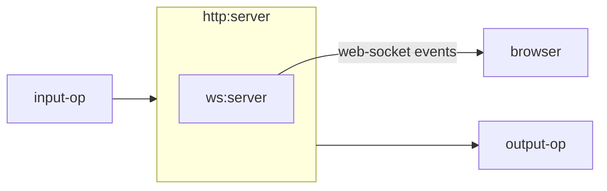
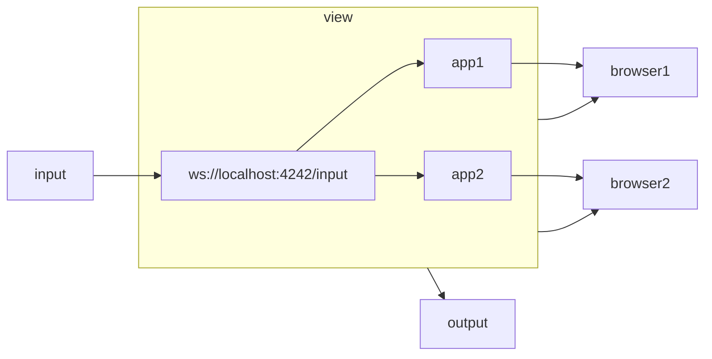

# Http Ops

This module brings http based technologies to ops4j.

# Operations

## http:server

Design 1, using web-sockets.

```bash
op1 | web:socket 
```



1. data flows into the http:server through execute(OpData input) and is appended to a List of ObjectNode.

2. The data is also sent to the internal ws:server which notifies any clients of data changes.

3. Browser apps can update with object constancy
   
   1. Flubber

## wss




